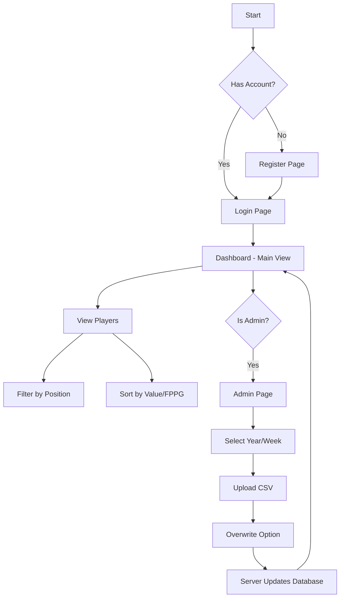

# Application Workflows

## Web App Workflow
The Web Dashboard is the central hub for data analysis and administrative management.



### Key Features
1.  **Authentication**: Secure Register/Login flow.
2.  **Dashboard**: Real-time filtering and sorting of thousands of players.
3.  **Admin Panel**: Restricted area for uploading weekly player data (CSV).

---

## Mobile App Workflow
The Mobile App focuses on Roster Construction using the data provided by the Web App.

```mermaid
graph TD
    A[Open App] --> B{Has Token?}
    B -- Yes --> C[Dashboard Screen]
    B -- No --> D[Login Screen]
    
    D --> C
    
    C --> E[View Players (Current Week)]
    E --> F[Tap Player (+)]
    F --> G{Roster Full?}
    G -- No --> H[Add to Roster]
    G -- Yes --> I[Show Alert]
    
    C --> J[My Roster Tab]
    H --> J
    
    J --> K[View Selected Team]
    K --> L[Remove Player (-)]
    K --> M[Save Roster]
    M --> N[Sync with Server]
```

### Key Features
1.  **Roster Building**: Select players up to the salary cap ($60,000).
2.  **Live Stats**: Uses the latest FPPG/Salary data from the production database.
3.  **Synchronization**: Saves rosters to the backend to persist across devices.
