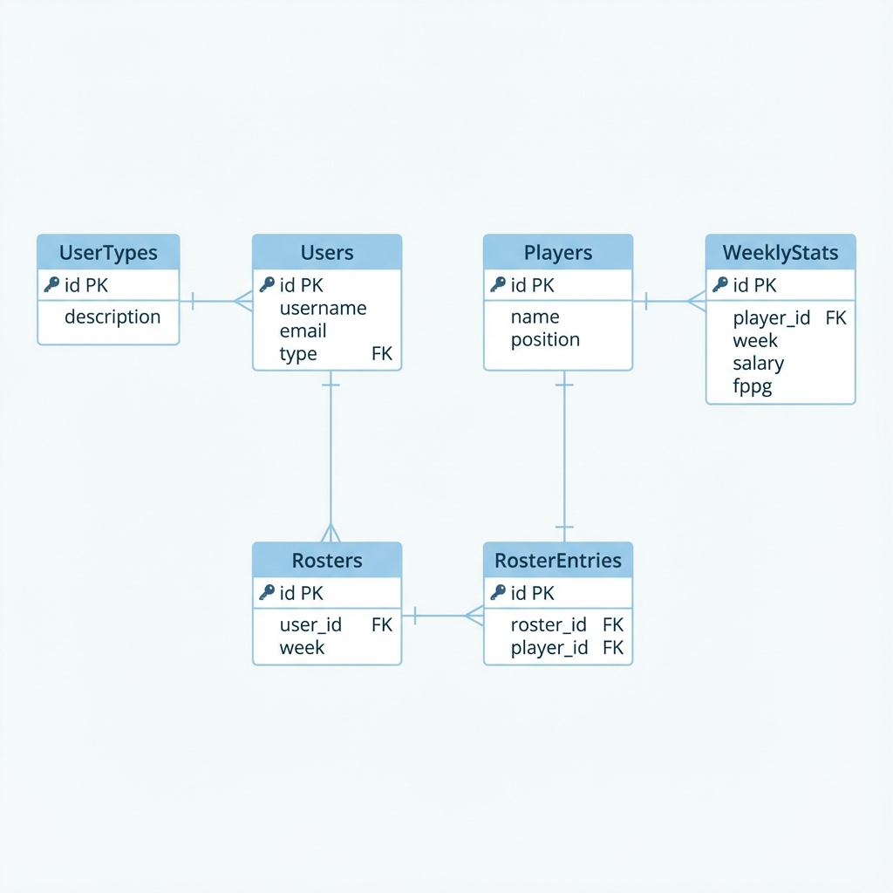
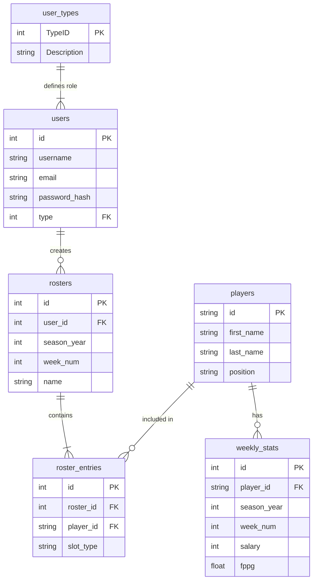

# PostgreSQL Database Schema

The Web App and Mobile App share the **same** PostgreSQL database. There is no difference in data source; both applications access the exact same tables via the API.

## Tables

### 1. `users`
Stores user account information.
- `id`: PK, Serial
- `username`: String (Unique)
- `email`: String (Unique)
- `password_hash`: String (Bcrypt)
- `type`: Integer (FK to `user_types`, Default 1)
- `created_at`: Timestamp

### 2. `user_types`
Lookup table for user roles.
- `id`: PK
- `description`: 'Normal' or 'Admin'

### 3. `players`
Static player information that rarely changes.
- `id`: PK, String (e.g., "78912")
- `first_name`: String
- `last_name`: String
- `position`: String (QB, RB, WR, TE, D)

### 4. `weekly_stats`
Dynamic weekly performance data for players.
- `id`: PK, Serial
- `player_id`: FK to `players`
- `season_year`: Integer (e.g., 2025)
- `week_num`: Integer (e.g., 16)
- `salary`: Integer
- `fppg`: Float
- `team`: String (e.g., "MIA")
- `opponent`: String (e.g., "CIN")
- `injury_status`: String (Optional)
- **Constraint**: Unique combination of `(player_id, season_year, week_num)`

### 5. `rosters`
User-created lineups.
- `id`: PK, Serial
- `user_id`: FK to `users`
- `season_year`: Integer
- `week_num`: Integer
- `name`: String
- `created_at`: Timestamp

### 6. `roster_entries`
The players inside a specific roster.
- `id`: PK, Serial
- `roster_id`: FK to `rosters`
- `player_id`: FK to `players`
- `slot_type`: String ("QB", "RB", "FLEX", etc.)

## Views

### `player_weekly_stats_view`
A unified view joining `players` and `weekly_stats` for easy querying.
**Columns**:
- `player_id`
- `first_name`
- `last_name`
- `position`
- `salary`
- `fppg`
- `team`
- `opponent`
- `injury_status`
- `season_year`
- `week_num`

## Entity Relationship Diagram (ERD)

